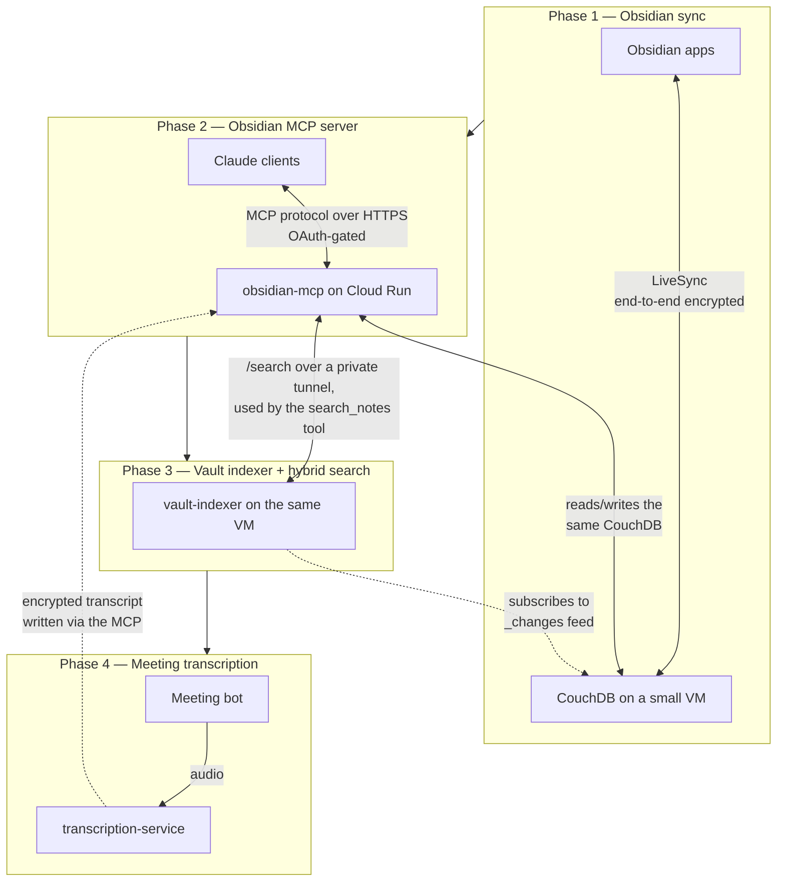
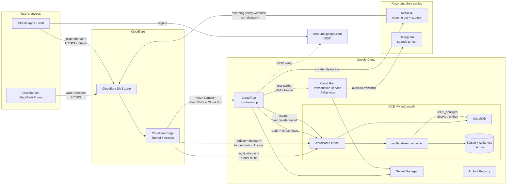
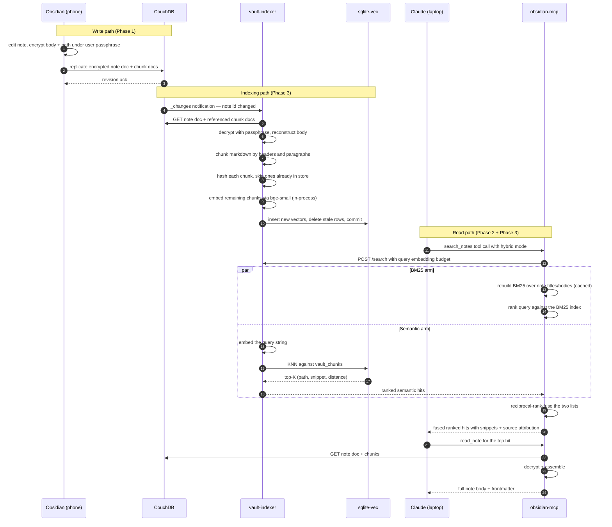
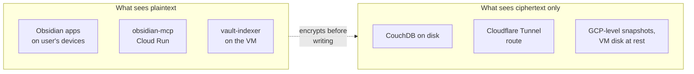

# System overview

This is a personal knowledge stack — an Obsidian vault that lives in your pocket, on your desk, and on the open web at the same time, and that an AI assistant can read, write, and semantically search. It is built in four phases, each one self-contained and each one composing cleanly with the previous.

The system runs on a single Google Cloud project, fronted by a Cloudflare zone, and costs roughly $11–14 per month at steady state, plus a few cents per recorded meeting once Phase 4 is in use. The only home for any data outside this stack is the user's notes, in plaintext, inside the Obsidian apps on their devices — with one deliberate exception in Phase 4, where a meeting bot necessarily lets a third party hear a call's audio in plaintext before the transcript is encrypted back into the vault.

## The four phases

The stack is layered. Each phase adds a capability without changing the contract of the phases beneath it.

- **Phase 1** is just Obsidian sync. A small GCE VM runs CouchDB; the Obsidian Self-hosted LiveSync plugin on each device replicates notes in and out of it; a Cloudflare Tunnel exposes the CouchDB to those clients without ever opening a firewall port. All note content is encrypted on the device with a user-chosen passphrase before it touches the wire, so what CouchDB and Cloudflare see is ciphertext.
- **Phase 2** is the MCP server. A Cloud Run service speaks the Model Context Protocol so that Claude (the chat client) can call tools — read a note, write a note, search lexically, list recent changes. The service knows the LiveSync passphrase (it has to, to read your notes), authenticates Claude with OAuth 2.1, and authenticates the user with Google Sign-In behind a small allow-list.
- **Phase 3** is semantic search. A second container runs next to CouchDB on the Phase 1 VM. It subscribes to CouchDB's change feed, embeds new note chunks in-process with a small open-weights model (`bge-small-en-v1.5`), stores 384-dimensional vectors in a SQLite file via the `sqlite-vec` extension, and exposes a private `/search` endpoint that the MCP server calls. The MCP fuses the indexer's semantic hits with its own BM25 (keyword) results using reciprocal rank fusion, so a query catches both keyword and meaning matches.
- **Phase 4** is meeting transcription. A bot — dispatched from Claude through a new MCP tool — joins a Zoom, Meet, or Teams call and records the audio; a new, isolated `transcription-service` turns that audio into a diarized transcript (a cloud speech-to-text provider today, swappable for a local model later); and the MCP writes the transcript into the vault as an ordinary encrypted note, which Phase 3 then indexes like anything else. This is the one phase whose live data a third party necessarily sees in plaintext — a meeting bot is a participant in the call — so the exposure is confined to a transient hop and only the finished transcript is end-to-end encrypted.

## Top-level topology

This is everything in the stack, on one page.

A few non-obvious things to notice:

- The MCP server talks to CouchDB through `vault.<domain>` — it does **not** sit on the same network as the VM, so it goes the long way around via Cloudflare. This is a deliberate simplification: there is no VPC peering, no VPC connector, no internal load balancer. The MCP is treated as just another LiveSync client.
- The MCP also talks to the vault-indexer through `indexer.<domain>` — also via Cloudflare, also gated. The indexer is on the same VM as CouchDB but the MCP is the only caller in the system, so a private hostname with Cloudflare Access in front of it is the chosen way to authenticate that caller.
- `mcp.<domain>` is the only hostname **not** routed through a Cloudflare Tunnel. It uses Cloud Run's native custom-domain feature (a managed TLS cert and a DNS CNAME to `ghs.googlehosted.com`) because Cloud Run handles the auth flow at the application layer and there is no on-VM service to tunnel to.
- Phase 4 adds two outbound dependencies the rest of the stack does not have: the MCP calls Recall.ai to run a meeting bot, and the `transcription-service` calls Deepgram for speech-to-text. The transcription-service is itself a second Cloud Run service with **no public hostname at all** — it is reachable only by the MCP's service account over Cloud Run IAM, and it holds no vault passphrase. Recall's recording-ready webhook is the only inbound call that reaches `mcp.<domain>` without an OAuth token; it is verified by signature instead.

## A note's lifecycle, end-to-end

This is what happens when the user edits a note in Obsidian on their phone and then, an hour later, asks Claude on their laptop "what did I say about X?".

Two threads are running concurrently in real life: every write fans out to the indexer through the `_changes` feed (steps 4–11), and every search fans out to both indexes in parallel (steps 14–21). A Phase 4 meeting transcript enters this same picture at the write path — once the MCP writes the transcript note, it is indexed and searchable exactly like a hand-typed one. The [Phase 4 doc](04-phase4-transcription.md) traces the capture-to-note path in full.

## Trust model at a glance

- The LiveSync passphrase is the only key. It is held by every Obsidian device, by the MCP service account (via Secret Manager), and by the vault-indexer (also via Secret Manager). Anything that holds the passphrase sees plaintext; everything else sees ciphertext.
- Encryption at rest is for the bytes on Cloudflare's path and on the GCP-level disk, **not** for hiding the notes from the MCP server or the indexer. That is by design — the MCP exists precisely to expose notes to Claude.
- The MCP server gates access at two levels: OAuth 2.1 (the client must hold a valid access token) and an email allow-list (Google Sign-In must return a `sub` for a configured email). The token signing key (RSA-2048) and the Google client secret are stored in Secret Manager.
- The indexer's `/search` is gated at three levels: Cloudflare Access (only requests carrying the MCP-to-indexer service token pass the edge), the indexer's own bearer token check (a 48-character random secret shared with the MCP), and the fact that nothing outside the MCP service account knows where the indexer lives at all.
- **Phase 4 is the one place this model bends.** A meeting bot is a participant in the call, so the bot vendor (Recall.ai) and the speech-to-text provider (Deepgram) necessarily see the meeting's audio in plaintext — there is no end-to-end-encrypted way to record a meeting. The exposure is confined to a transient hop (short retention, deleted right after transcription), the `transcription-service` itself holds no passphrase and cannot read the vault, and the finished transcript is encrypted back into the vault like any other note. The [Phase 4 doc](04-phase4-transcription.md) gives the full accounting.

## Cost

Steady-state, US billing, no traffic spikes.

| Item | Service | Approx monthly |
|---|---|---|
| Domain | Cloudflare Registrar (`.studio`) | ~$1.00 (amortized from annual) |
| VM | GCE `e2-small`, `pd-standard`, STANDARD network tier | ~$10–13 |
| Cloud Run | obsidian-mcp + transcription-service; both scale to zero | ~$0.20 |
| Artifact Registry | Three repos; small images | ~$0.10 |
| Secret Manager | A handful of secrets, low access volume | < $0.10 |
| Cloud Logging / Monitoring | Ops Agent on the VM, Cloud Run defaults | < $0.50 |
| **Total** | | **~$11–14** |

Phase 1 alone on `e2-micro` is free under GCP's always-free tier. Phase 3 pushed the VM past the free RAM ceiling, so the stack moved to `e2-small`. The cost delta buys deterministic deploy times and enough headroom to run a backfill alongside the live indexer without thrashing.

Phase 4 adds no fixed monthly cost — its `transcription-service` scales to zero — but meeting recording is usage-based: about $0.88 per recorded hour (Recall.ai capture plus Deepgram speech-to-text), billed only when a bot actually runs, and nothing in a month with no meetings.

## Where the pieces live in code

| Layer | Path | What's there |
|---|---|---|
| Terraform | `terraform/` | All cloud resources: VM, Cloud Run services, secrets, IAM, Artifact Registry, Cloudflare DNS + Access |
| VM bootstrap | `scripts/obsidian/cloud-init.yaml` | Sets up Docker, writes the CouchDB compose, schedules the tunnel + couchdb-init steps |
| Obsidian sync setup | `scripts/obsidian/setup-tunnel.sh` | One-time, runs on the VM after first SSH |
| MCP service | `services/obsidian-mcp/` | TypeScript Cloud Run service (Effect.ts + MCP SDK + OAuth server); also hosts the meeting-bot tools and the Recall webhook |
| Indexer service | `services/vault-indexer/` | TypeScript on-VM service (Effect.ts + bge-small + sqlite-vec) |
| Transcription service | `services/transcription-service/` | TypeScript Cloud Run service (Effect.ts + a pluggable speech-to-text backend) |
| Shared library | `services/shared/` | CouchDB client, LiveSync E2EE codec, tagged errors, logger — used by all the services |
| Deploy scripts | `scripts/*/deploy.sh` | Build → push → ship for each service |

## Reading order for the rest of these docs

- **[Phase 1: Obsidian sync](01-phase1-obsidian-sync.md)** — the VM, CouchDB, LiveSync's encryption format, and the Cloudflare Tunnel that connects them.
- **[Phase 2: Obsidian MCP server](02-phase2-mcp-server.md)** — the Cloud Run service, its OAuth + Google OIDC setup, and how a tool call moves through it.
- **[Phase 3: Vault indexer and hybrid search](03-phase3-vault-indexer.md)** — the on-VM indexer, its incremental embedding pipeline, the vector store schema, and the reciprocal-rank-fusion search that the MCP exposes to Claude.
- **[Phase 4: Meeting transcription](04-phase4-transcription.md)** — the meeting bot, the isolated transcription-service and its pluggable speech-to-text backend, how a recording becomes an encrypted transcript note, and the trust trade-off a meeting bot forces.

Each phase doc is self-contained but assumes you have already read this overview.
