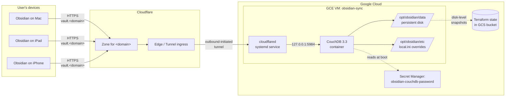
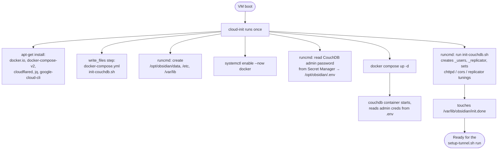
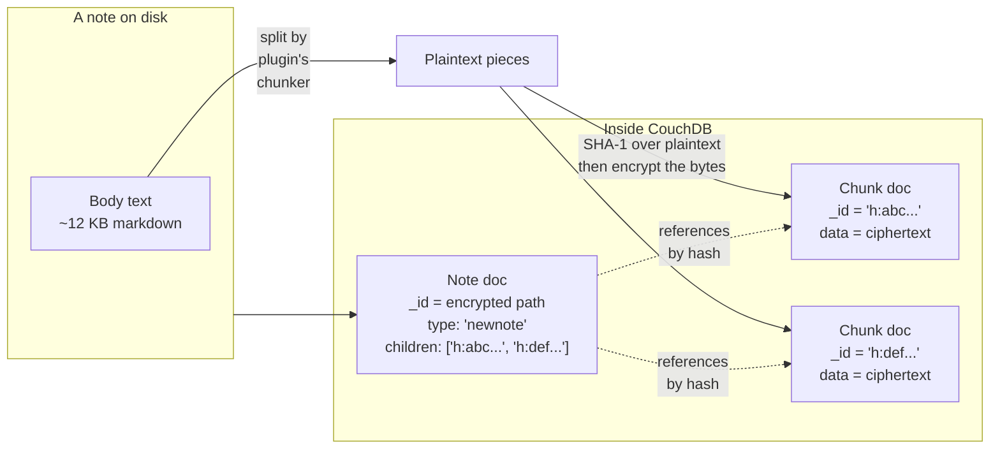
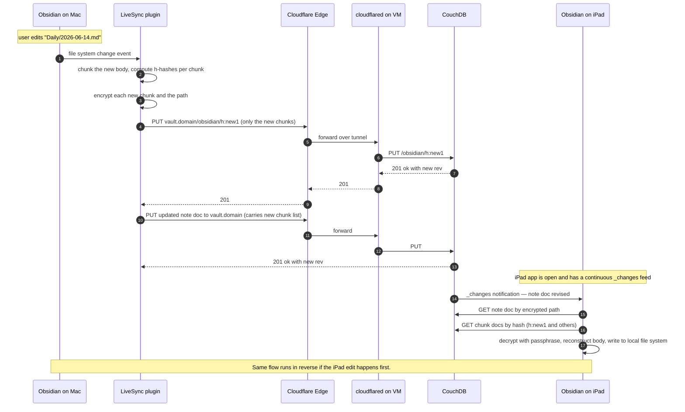
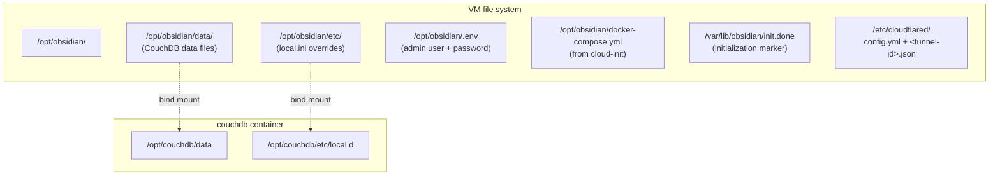
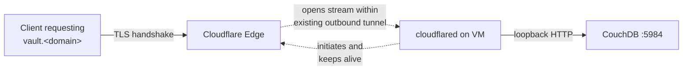

# Phase 1: Obsidian sync

The job of Phase 1 is to give the Obsidian Self-hosted LiveSync plugin a backend to talk to. That backend is a single CouchDB database, running in a Docker container on a small GCE VM, reached from outside the VM through a Cloudflare Tunnel. Once Phase 1 is up, any number of Obsidian devices can replicate notes in and out of that database under a user-chosen passphrase that the server never sees.

The whole phase is deliberately small. Nothing in this phase has any concept of "the user" beyond the fact that there is one CouchDB admin and that admin holds the passphrase. There is no API, there is no UI; the only protocol that matters is CouchDB's own replication protocol.

## What this phase delivers

- A CouchDB instance reachable at `https://vault.<domain>` over the public internet, with TLS terminated by Cloudflare.
- A free or near-free hosting footprint: the VM was originally `e2-micro` (always-free tier). Phase 3 pushed the stack to `e2-small`, which is roughly $10–13/month.
- A trust model where notes are encrypted on the device before they leave it, so the server stores ciphertext and Cloudflare relays ciphertext.
- A clean foundation for Phase 2 (the MCP server) and Phase 3 (the indexer) to consume.

## Components

The pieces are:

- **A GCE VM** named `obsidian-sync`, in `us-east1-b`. It has 30 GB of `pd-standard` boot disk and STANDARD-tier networking — those two pins, plus the machine type and region, are what keep the VM inside the GCP free tier (before Phase 3 pushed the machine type up).
- **A docker-compose stack** on the VM with one service in it: `couchdb:3.3`. The compose file is written at VM creation time by cloud-init.
- **The cloudflared daemon**, installed and configured by a one-time script that runs on the VM after first SSH. It runs as a systemd service, holds the tunnel credentials in `/etc/cloudflared/`, and reads its routing rules from `/etc/cloudflared/config.yml`.
- **Cloudflare's edge**, fronting `vault.<domain>` and routing matching requests to the tunnel.
- **A Secret Manager secret** holding the CouchDB admin password. The VM's service account has `roles/secretmanager.secretAccessor` on this single secret — nothing else.
- **Terraform**, which provisions all of the above (VM, secret, IAM bindings, Cloudflare DNS) and writes its state to a GCS bucket so the same configuration is reproducible.

## Bootstrap: how a fresh VM becomes a working node

The VM only gets created once. After that, cloud-init runs once at first boot and does everything below. None of these steps re-run on subsequent reboots; the file on disk is the source of truth.

After cloud-init completes, the operator does one more manual step: `gcloud compute ssh` into the VM and run `scripts/obsidian/setup-tunnel.sh`. That script:

1. Installs the tunnel's per-tunnel credentials file (a JSON containing the tunnel ID and a signing key) at `/etc/cloudflared/<tunnel-id>.json`.
2. Writes `/etc/cloudflared/config.yml` with the tunnel ID, the credentials path, and the routing table (one entry mapping `vault.<domain>` to `http://localhost:5984`, plus a `service: http_status:404` catch-all).
3. Runs `cloudflared service install` and `systemctl enable --now cloudflared`, so the tunnel comes back up automatically on every boot.

The tunnel itself is created earlier on the operator's workstation — that side requires an interactive `cloudflared tunnel login` against a Cloudflare account, which is why it isn't in Terraform. Once the tunnel exists, Terraform creates the matching Cloudflare DNS record (a proxied CNAME pointing `vault.<domain>` at `<tunnel-id>.cfargotunnel.com`) so the route at the edge is in version control even though the credentials are not.

## The LiveSync protocol, in just enough detail

Obsidian's Self-hosted LiveSync plugin is what makes a CouchDB database into a working sync backend. The plugin runs in the Obsidian app, watches for note changes on the device, and replicates them in and out of CouchDB using CouchDB's normal replication protocol.

The wire format inside CouchDB is not "one document per note." It is content-addressed:

What that means in practice:

- A note is split into chunks of roughly equal size by a plugin-side splitter.
- Each chunk is identified by a hash of its **plaintext**, prefixed with `h:` (so `h:abc...`). Identical chunks across different notes deduplicate naturally — you only ever store one copy.
- The chunk's `data` field stores the ciphertext: the plaintext chunk encrypted under the user's E2EE passphrase using HKDF-V2 (per-message ephemeral salt, AES-GCM payload).
- The "note doc" is the entry point. Its `_id` is the note's path, also encrypted; its body holds an ordered list of chunk hashes; its other fields carry obfuscated metadata (a small encrypted blob with frontmatter-ish data).
- There are a handful of other prefixes inside the database — `i:` for plugin internal docs, `_local/` and `_design/` for CouchDB system docs, `h:+` for an alternate encrypted-chunk shape. Anything not starting with one of these is a real note path (encrypted).

The encryption choice — HKDF-V2 with ephemeral salts — is meaningful for clients and indexers that read from the database. Each ciphertext carries its own salt prefix; the decryptor needs both the passphrase and the per-message salt to derive the AES key. No ciphertext can be decrypted without the passphrase.

## How a note edit propagates

Two things to notice. First, the plugin only sends **new** chunks. If the user added a sentence to a 50-page note, only the changed chunk needs uploading; the rest are reused by hash. Second, the propagation to other devices is push-driven: every Obsidian client opens a long-poll on CouchDB's `_changes` feed and pulls revisions as soon as they land.

## What lives where on the VM

Important points:

- **All persistent state is in `/opt/obsidian/data/`.** This is the only directory backed by the persistent disk that matters for vault recovery. A backup is a copy of this directory plus the `.env` (for credentials) plus the LiveSync passphrase (held by the user separately).
- **The admin credentials are derived from Secret Manager.** Cloud-init reads the CouchDB password at first boot and writes it into `/opt/obsidian/.env`. Rotation is a Terraform-side change followed by a one-time re-read on the VM.
- **`/etc/cloudflared/config.yml` is the routing table.** A new ingress rule (e.g., the indexer added in Phase 3) is added there, then `systemctl restart cloudflared` picks it up.

## Cloudflare Tunnel: outbound-only by design

The most important property of the tunnel is that the VM never accepts inbound connections from the internet. There is no public IP listening on port 443. The cloudflared daemon initiates a long-lived outbound connection to Cloudflare's edge, and Cloudflare uses that channel to forward incoming requests for `vault.<domain>`.

This has three nice properties:

- The VM's GCP firewall can deny all inbound traffic. No firewall rules to maintain.
- TLS is terminated at Cloudflare's edge, so the operator never manages certificates.
- The Cloudflare zone's DNS record is a CNAME to `<tunnel-id>.cfargotunnel.com`, so changing tunnels is a one-line config edit and a DNS apply.

## Trust model

The threat model for Phase 1 is "an operator with full access to GCP, full access to Cloudflare, and full access to the VM's disk should still not be able to read the user's notes." It is satisfied by the LiveSync E2EE setup:

| Component | Sees plaintext? | Why |
|---|---|---|
| Obsidian app on the device | Yes | Holds the passphrase entered by the user |
| CouchDB | No | Stores only encrypted chunk bodies; sees encrypted paths |
| Persistent disk on the VM | No | Same; bytes-at-rest are ciphertext from the plugin |
| Cloudflare Tunnel route | No | The tunnel relays opaque bytes from device to CouchDB |
| Cloudflare Edge | No | TLS termination; payload is encrypted application content |
| GCP-level disk snapshots | No | Backed-up bytes are ciphertext |
| Operator with VM SSH access | No | Cannot decrypt without the passphrase |

The CouchDB admin password is a separate secret from the LiveSync passphrase. The admin password authenticates the CouchDB connection (so anonymous internet traffic can't write to the database); the passphrase decrypts content. They are unrelated.

The two passphrases the user must protect:

- **The CouchDB admin password.** Generated by Terraform via `random_password`. Lives in Secret Manager. Used by every LiveSync client in its connection config, and read by cloud-init on the VM. Rotation requires reconfiguring every device.
- **The LiveSync E2EE passphrase.** Chosen by the user when they first turn on E2EE in the plugin. Lives in the user's password manager. Used by every LiveSync client and by every server-side reader (the MCP server in Phase 2, the indexer in Phase 3). Rotation requires re-encrypting the entire vault and reconfiguring every client.

## Operational notes

- **The free tier is real money.** The Terraform pins `e2-micro`, `pd-standard`, and STANDARD-tier networking. Changing any of those — including to `pd-balanced` — moves the VM into paid pricing. Free-tier eligibility is also per-billing-account, not per-project: a `e2-micro` already running elsewhere on the same billing account disqualifies this one.
- **Cloud-init only runs at first boot.** Adding a step to `cloud-init.yaml` after the VM exists has no effect on the running VM. Operational changes (new compose service, new directory, new env var) belong in deploy scripts, not in cloud-init.
- **CouchDB tunings live in `/opt/obsidian/etc/local.d/`.** This is a bind-mounted overrides directory; CouchDB merges any `.ini` file there on top of its defaults at startup. The init script writes connection limits, CORS settings, and replicator tunings here once at first boot. Later changes require restarting the CouchDB container.

## How Phase 1 composes with later phases

Phase 2 and Phase 3 are both consumers of the CouchDB database that Phase 1 stands up. Neither phase changes anything Phase 1 owns:

- The MCP server (Phase 2) reads and writes through the same `vault.<domain>` hostname that the Obsidian clients use. It authenticates with a non-admin CouchDB user (provisioned by a one-shot script after Phase 1 is up). It holds the LiveSync passphrase in Secret Manager and decrypts/encrypts in-process.
- The vault-indexer (Phase 3) runs on the same VM as CouchDB but is a separate container. It connects to CouchDB on the in-container Docker network (`http://couchdb:5984`) — it doesn't go through cloudflared. It also holds the LiveSync passphrase in Secret Manager and decrypts in-process.

The Phase 1 abstractions Phase 2 and Phase 3 rely on are: the existence of CouchDB at a known location, the chunked-and-encrypted document shape, and the `_changes` feed for incremental updates. Anything else inside Phase 1 (the cloud-init, the tunnel, the bootstrap script) is invisible to them.
