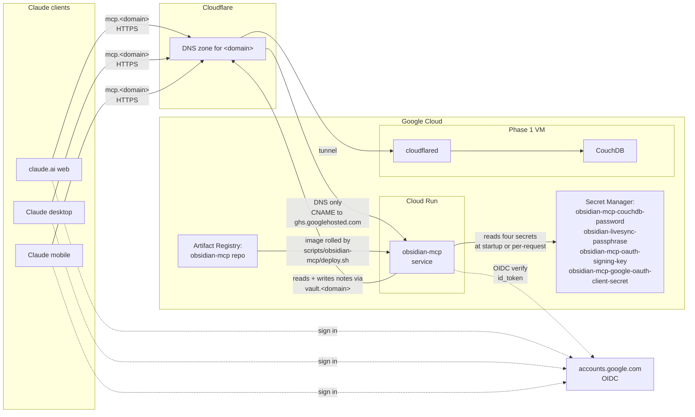
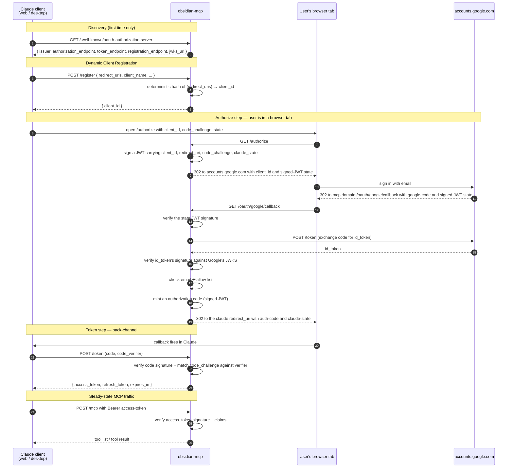
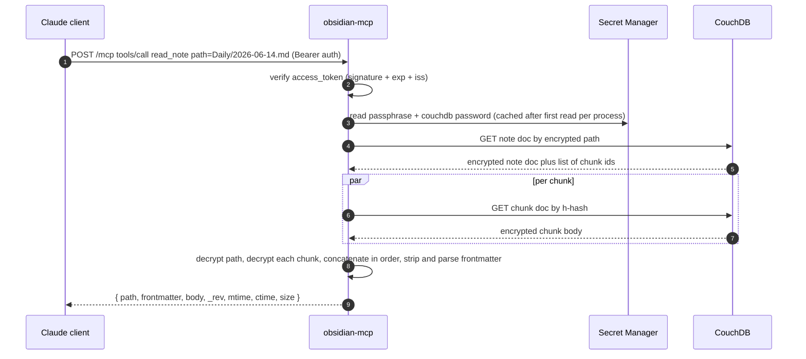
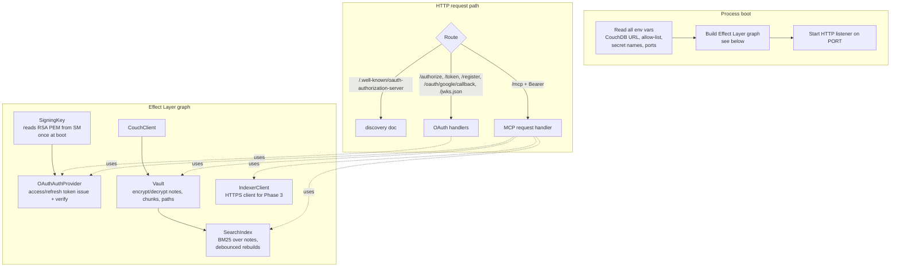
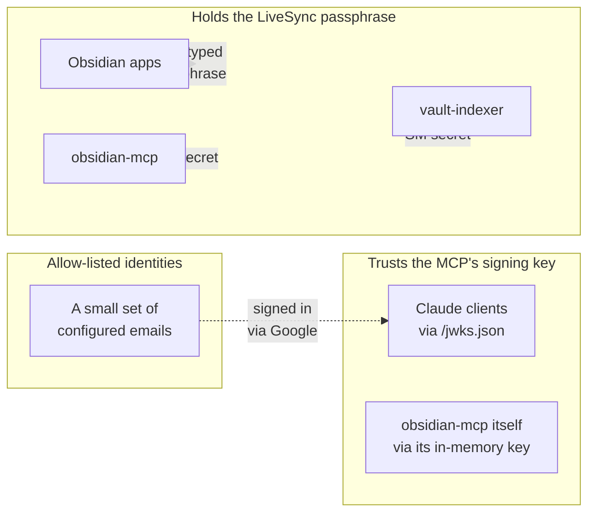

# Phase 2: Obsidian MCP server

The job of Phase 2 is to take the CouchDB-backed vault that Phase 1 stands up and expose it to Claude as a set of tools: read a note, list notes, create a note, edit a note in place, search the vault. The exposure happens over the Model Context Protocol — the same protocol Claude uses to talk to any other MCP server — and is gated by an OAuth 2.1 server that lives inside the same Cloud Run service.

This phase introduces nothing about indexing or semantic search. Search in Phase 2 alone is full-text BM25 over note titles and bodies, with the index built lazily in memory from the contents of CouchDB. Phase 3 layers semantic search on top.

## What this phase delivers

- An MCP endpoint reachable at `https://mcp.<domain>` that Claude clients (web, desktop, mobile) can add as an MCP server.
- A self-contained OAuth 2.1 authorization server with Dynamic Client Registration, Authorization Code + PKCE flow, and refresh tokens, all signed by an RSA key the service holds in Secret Manager.
- Google Sign-In as the identity provider behind that OAuth server, gated by an email allow-list so only the user can complete the handshake.
- Tools that read and write the same encrypted vault Phase 1's Obsidian clients use, doing the LiveSync encryption/decryption in-process.

## Components

The pieces are:

- **A Cloud Run service** named `obsidian-mcp`, in `us-east1`, single revision, scales to zero. Min instances zero, max instances one — this is a personal workload that never needs to scale.
- **A Cloud Run domain mapping** that wires `mcp.<domain>` directly to the service. There is no Cloudflare Tunnel on this path. Cloud Run provisions and renews the TLS cert itself; the Cloudflare DNS zone holds a CNAME to `ghs.googlehosted.com`, set to DNS-only (no orange cloud).
- **A dedicated service account** for the MCP. It has four narrowly-scoped Secret Manager grants and no other project-level permissions.
- **Four Secret Manager secrets** the MCP reads:
  - `obsidian-mcp-couchdb-password` — the scoped non-admin user the MCP authenticates as when it talks to CouchDB. A separate user from the admin so the MCP can be rotated independently of the LiveSync clients.
  - `obsidian-livesync-passphrase` — the LiveSync E2EE passphrase. This is the same string the user typed into each Obsidian device. It's how the MCP can read plaintext.
  - `obsidian-mcp-oauth-signing-key` — an RSA-2048 PKCS#8 PEM the MCP's OAuth server uses to sign authorization codes, access tokens, refresh tokens, and the Google round-trip state JWT. The matching public key is exposed at `/jwks.json` so anyone can verify tokens the server issued.
  - `obsidian-mcp-google-oauth-client-secret` — the client secret of the Google OAuth web client the MCP uses for the OIDC handshake.
- **An Artifact Registry repository** holding the built container image. Each deploy pushes a new image tagged with the git SHA and rolls a new Cloud Run revision.
- **Phase 1's CouchDB**, reached over the same `vault.<domain>` tunnel hostname every Obsidian client uses. The MCP is, from Cloudflare's perspective, just another LiveSync client.

## Why the MCP talks to CouchDB through Cloudflare

A more "ordinary" architecture would put Cloud Run and the VM on the same VPC, give the Cloud Run service a Serverless VPC Connector, and let it reach CouchDB at the VM's internal IP. This stack does not do that. Cloud Run reaches CouchDB through `https://vault.<domain>`, the public tunnel hostname.

This is intentional: it means there is no VPC peering, no Serverless VPC Connector, no separate firewall rule, and no special networking primitive in Terraform. The MCP is treated as just another LiveSync client. The cost is one extra hop and one extra TLS handshake per CouchDB request. Both are noise compared to the embedding and CouchDB query time.

## The OAuth dance, end to end

The MCP server is itself an OAuth 2.1 authorization server. It does not delegate authorization to Google or to any other provider in the OAuth sense. What it does delegate to Google is **identity** — when a user first authorizes a Claude client, the MCP routes them through Google Sign-In to learn who they are.

The pieces of this that are worth knowing:

- **DCR (Dynamic Client Registration) returns a deterministic client_id.** The MCP hashes the requested `redirect_uris` and returns the resulting hash as the client_id. There is no per-client database; if Claude registers the same redirect URIs again, it gets the same client_id back. This keeps the MCP stateless on the registration side.
- **The state JWT round-trips through Google.** When the MCP redirects the user to Google, the OAuth `state` parameter is a signed JWT carrying everything the MCP needs to resume the flow when the user comes back: the original `client_id`, the original `redirect_uri`, the PKCE `code_challenge`, and the Claude-supplied `state` (which the MCP must forward back to Claude verbatim). Because the JWT is signed with the MCP's key, the MCP can verify it on return without storing any session state.
- **The id_token is verified against Google's JWKS.** The MCP fetches `https://www.googleapis.com/oauth2/v3/certs` to get Google's current signing keys, verifies the id_token signature, and reads the `sub` and `email` claims from it. No state about which user just signed in is stored.
- **The allow-list is the only authorization check.** After verifying the id_token, the MCP checks whether the email is in a configured set. If not, the flow ends with a redirect to a "this email isn't allowed" page. If yes, the MCP mints an authorization code (another signed JWT) and redirects to the Claude redirect URI.
- **PKCE is enforced end to end.** The original `code_challenge` is included in the authorization code JWT. When Claude redeems the code at `/token`, it must supply a `code_verifier` whose SHA-256 hash matches the original challenge. Without that, the redemption fails.
- **Access and refresh tokens are signed JWTs.** All claims (subject, scope, expiry) are carried in the token itself; the MCP verifies them on each request against its own JWKS endpoint. No server-side session store.

The single signing key (RSA-2048, PKCS#8 PEM) is the foundation for everything: it signs the state, the authorization code, the access tokens, and the refresh tokens. Rotating it invalidates every issued token immediately — the `kid` (key ID) changes and old tokens fail verification. That is also the manual recovery path on any suspected token compromise.

## How a tool call moves through the server

Once the OAuth handshake is done and Claude holds an access token, every tool call looks like this:

Two things to notice:

- **CouchDB reads are parallel within a note.** The note doc carries an ordered list of chunk hashes; the MCP fetches all of them concurrently and assembles the plaintext in chunk-id order. For a 50 KB note that might be a dozen chunk GETs, fanned out at once.
- **Secrets are read once and cached.** The MCP holds the passphrase in memory after the first read. A passphrase rotation requires a service redeploy or a manual restart of the running revision; there is no in-process refresh.

Write tools (`create_note`, `update_note`, `append_to_note`, `edit_note`, `delete_note`) follow the same pattern in reverse: the MCP fetches the current note doc (for `_rev`-aware conflict handling), reads the existing chunk list, computes a new chunk list, encrypts new chunks and the new path, and PUTs them to CouchDB. The plugin's `_changes` listener on each device picks them up and reconstructs the file locally on the next sync cycle.

## In-process layout

The Cloud Run process is a single Node.js bundle (`dist/main.js`) produced by tsup from the TypeScript source. Inside, it uses Effect.ts to compose service "layers" — a CouchDB client, the Vault wrapper that handles E2EE, an OAuth signing key handle, a BM25 search index, and so on — into a single runtime that the HTTP request handler uses.

The `IndexerClient` is the only piece in this picture that didn't exist in Phase 2 alone — Phase 3 added it so the MCP could call the vault-indexer's `/search`. With Phase 3 deployed, the hybrid search path uses both `SearchIndex` (BM25, in-process) and `IndexerClient` (HTTPS to the on-VM indexer) in parallel and fuses the results with reciprocal rank fusion. Without Phase 3 deployed, the `IndexerClient` is still wired in but every call surfaces an `IndexerUnavailableError`, which the search handler catches and treats as "fall back to lexical-only with a logged warning."

## Trust model

The actors and their privileges:

| Actor | What they can do | Why |
|---|---|---|
| Any internet caller | Hit the `/.well-known/...` and `/jwks.json` endpoints | Public discovery; harmless |
| A Claude client that completed OAuth | Call MCP tools as the allowed user | Holds a valid access token |
| The MCP service account | Read four secrets from Secret Manager; read/write CouchDB; egress to Google's OIDC | Required for the tools to work |
| The Google client (configured separately) | Issue id_tokens for sign-in attempts | Standard OIDC provider |
| The Cloud Run service operator (you) | Deploy new revisions; read logs | GCP IAM |

The chain of trust runs: **Google's id_token signature** → MCP confirms the user's identity → **MCP's own signing key** → MCP issues an access token → **MCP verifies that access token on every request**. Compromise of the MCP's signing key is the worst single-key event; the recovery is rotation, which invalidates every issued token.

A user who is in the allow-list and signed in via Google has full access to the vault through the MCP — including the ability to read every note, write notes, and delete (soft-delete to `.trash/`) notes. The allow-list is meant to be very small (one to two emails); the protection model assumes that those identities are not adversarial.

## Operational notes

- **Rotating the LiveSync passphrase is expensive.** Every Obsidian device needs to be reconfigured. The MCP's secret needs to be updated. The vault-indexer's secret needs to be updated. Every existing note needs to be re-encrypted (the plugin has a flow for this). It's a deliberate, planned operation, not a routine one.
- **Rotating the OAuth signing key invalidates every issued token.** Claude clients will need to re-authorize. This is the recovery path on any suspected token compromise.
- **Cloud Run cold starts are fine for personal use.** First request after a quiet period takes ~2 seconds; subsequent requests within the keep-alive window are < 100 ms. There is no scaling on this service in practice.
- **The `/health` endpoint requires no auth.** It returns the service version and is what the deploy script polls after rolling a new revision.

## How Phase 2 composes with later phases

Phase 3 (the vault-indexer) is the only phase that consumes Phase 2 directly, and only in one direction: the MCP calls the indexer's `/search` endpoint as the semantic arm of `search_notes`. The indexer does not call the MCP, does not know about OAuth, and is not aware of the user.

Phase 3 also adds a fifth secret the MCP reads (`vault-indexer-search-token`, the bearer the MCP sends on every `/search` request) and two Cloudflare Access service-token credentials. The MCP's service account gets accessor grants on those three new secrets, but nothing else about the MCP changes — the OAuth flow, the tool surface, the in-process layout, and the trust model are unchanged.
