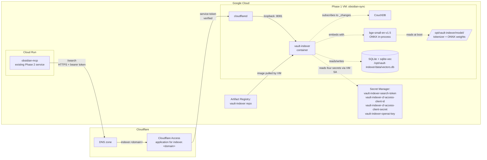
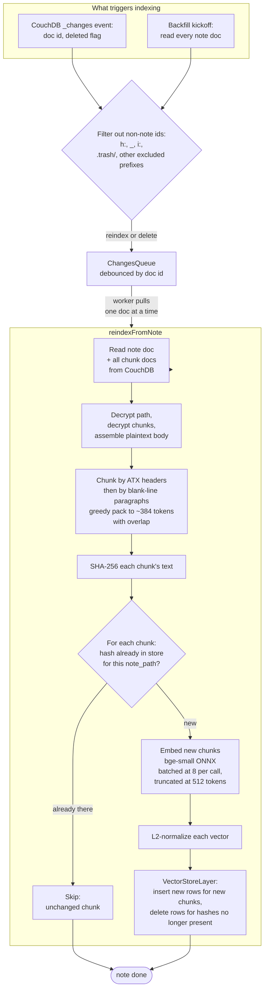
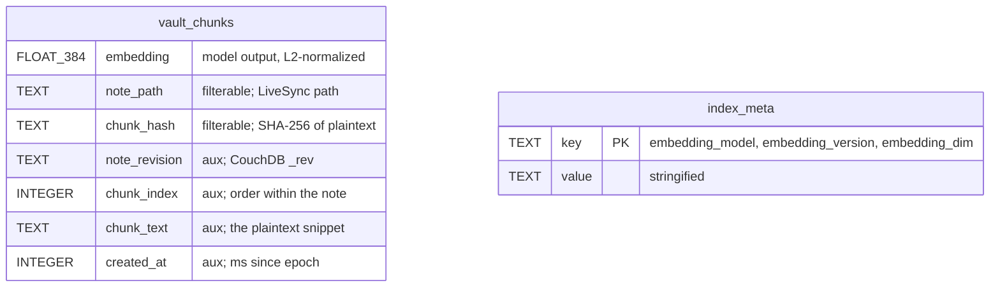
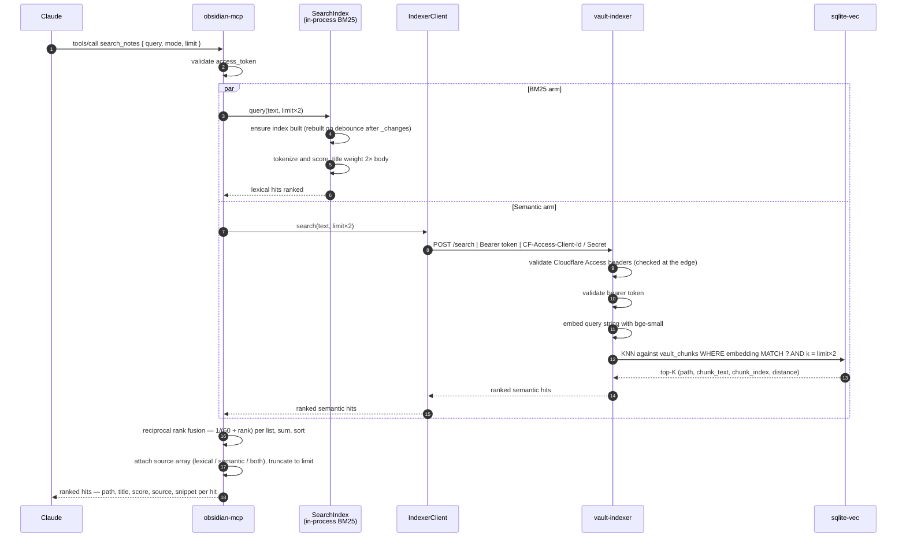

# Phase 3: Vault indexer and hybrid search

The job of Phase 3 is to make the vault semantically searchable. Phase 2's `search_notes` tool already did BM25 keyword search — that catches exact word matches but misses "the same idea, said differently." Phase 3 adds a second arm: a small embedding model runs over every note in the vault, stores vectors in a local database, and answers nearest-neighbor queries that surface notes by meaning. The MCP fuses the two arms together, so a single query catches both word matches and meaning matches.

This phase introduces one new container, runs it on the same VM as CouchDB, and adds a private hostname for the MCP to call. It changes nothing about how Phase 1 stores notes or how Phase 2 authorizes Claude. The only contract change to Phase 2 is that `search_notes` now has a `mode` parameter (`hybrid`, `lexical`, `semantic`).

## What this phase delivers

- A long-running indexer process on the Phase 1 VM that subscribes to CouchDB's `_changes` feed and keeps a vector store up to date in near-real-time.
- A private HTTP endpoint at `indexer.<domain>/search` that returns ranked semantic hits.
- A hybrid retrieval mode in the MCP's `search_notes` tool, fusing BM25 and semantic via reciprocal rank fusion.
- A one-shot backfill script that rebuilds the vector store from scratch against the current CouchDB.
- All of the above runs locally on the VM with no outbound traffic to an embedding API (the model is in-process).

## Components

The new pieces are:

- **The vault-indexer container.** A single TypeScript Node bundle plus its node_modules and an ONNX-runtime native binding. Runs as the `node` user (uid 1000) inside the container. Built on top of `node:22-bookworm-slim`.
- **A second Artifact Registry repo** (`vault-indexer`) just for indexer images. Separate from the MCP repo so image tags don't collide and so the VM's service account can be granted read on the indexer repo specifically.
- **A vector store on the VM's persistent disk** at `/opt/vault-indexer/data/vectors.db`. SQLite file with two tables (one virtual via `sqlite-vec`, one regular). Bind-mounted into the container so it survives container restarts.
- **The bge-small-en-v1.5 model files** at `/opt/vault-indexer/model/`. Quantized ONNX weights plus the matching tokenizer. Baked into the runtime image at build time via a dedicated `model-fetch` Docker stage, so the container has no outbound HTTP at runtime.
- **Four new Secret Manager secrets** for Phase 3:
  - `vault-indexer-search-token` — a random 48-char alphanumeric. The bearer token the MCP sends and the indexer checks on every `/search` request. The second of three trust layers (the first is Cloudflare Access; the third is the fact that this hostname is only known to the MCP service account).
  - `vault-indexer-openai-key` — optional. Only used by the evaluation harness when comparing embedders. Empty placeholder by default.
  - `vault-indexer-cf-access-client-id` / `...-client-secret` — the Cloudflare Access service-token credentials. The MCP sends these on every request to `indexer.<domain>`. The Access application at the Cloudflare edge admits only requests carrying matching credentials.
- **A Cloudflare Access application** in front of `indexer.<domain>`. Type `self_hosted`. Its single policy admits requests from the configured service token; there is no human-identity policy, so a human visiting the hostname in a browser is rejected. This is deliberate — the indexer is not a UI.
- **A new ingress route in `/etc/cloudflared/config.yml`** mapping `indexer.<domain>` to `http://127.0.0.1:8081` on the VM. Added by `scripts/vault-indexer/add-tunnel-route.sh` after the Access application is up.

## Why the indexer is on the VM, not Cloud Run

The MCP server (Phase 2) is on Cloud Run because Cloud Run is the right shape for a small, mostly-idle HTTPS service that gets cold-started by user traffic. The vault-indexer is **not** that shape:

- It needs to be always on to keep the `_changes` subscription alive. Cloud Run cannot run a continuously-connected background subscriber without paying for a min-instance reservation.
- It needs a local disk for the vector store. Cloud Run has no persistent disk; the alternative is a Cloud SQL or AlloyDB instance, which is more expensive than the entire VM.
- It needs CPU for embedding inference. Cloud Run's per-request CPU model fits poorly with "every change feed event embeds N chunks."

The Phase 1 VM is already running 24/7. Adding a second container next to CouchDB costs zero additional dollars, gets free access to CouchDB on the in-container Docker network (no Cloudflare round trip), and shares the same persistent disk for the vector store. The trade-off is that the VM must have enough RAM and CPU to host both — which is what moved the stack from `e2-micro` (1 GB) to `e2-small` (2 GB).

## Indexing pipeline, in detail

Things worth understanding:

- **The queue debounces bursts.** Every `_changes` event lands in a per-doc-id queue. If the same note doc is updated five times in two seconds (e.g., during a LiveSync conflict resolution), only one reindex pass runs at the end of the debounce window. The queue is in-process, not persistent — a restart loses pending work, but the next `_changes` cycle would catch up.
- **Diff-by-hash is what makes incremental indexing tractable.** Each chunk's text is hashed; if a chunk's hash is already in the store under the same `note_path`, we don't re-embed it. A small edit at the bottom of a 50 KB note triggers ~1 new embedding, not 50.
- **Batching is for memory, truncation is for safety.** Batching at 8 chunks per ONNX call keeps peak memory bounded. Truncating at the model's 512-token context limit prevents a chunk of dense code (where character-based token estimates undercount real tokens) from violating the input shape and crashing the ONNX runtime.
- **`.trash/` is excluded at this point.** The shared `isIndexablePath` predicate filters both the `_changes` event stream and the backfill iterator, so trashed notes are never embedded and never appear in search results.
- **The whole pipeline is idempotent.** Running it on an already-indexed vault is a no-op (every hash is already present). The backfill script and the live indexer use the same `reindexFromNote` function for this reason.

## The vector store schema

The vault-indexer uses `sqlite-vec`, a SQLite extension that adds a virtual-table type for fixed-dimension vectors. The schema is intentionally minimal: one virtual table for chunks, one regular table for index metadata.

The `vault_chunks` table is a sqlite-vec `vec0` virtual table. The column kinds matter:

- **`embedding`** is the actual vector. Its dimension (384) is baked into the schema — changing models with a different output dimension is a destructive schema change, not a drop-in swap.
- **Plain columns (`note_path`, `chunk_hash`)** are filterable metadata. The query planner can use them in `WHERE` clauses to prune candidates before computing distances. We use them for the diff path (find existing chunks for a note) and for the delete path (drop a note's chunks).
- **`+`-prefixed "auxiliary" columns** are opaque returnable blobs. Cheaper to store than plain columns, fine for things we want back from a query but never filter on — the snippet text, the chunk position within the note, the revision, the timestamp.

`index_meta` carries a single row keyed by `key`. It records which embedder produced the on-disk vectors. A container booting with a mismatched `EMBEDDER` setting fails loud at startup, rather than silently mixing two models' vectors. The keys are `embedding_model` (e.g. `bge-small-en-v1.5`), `embedding_version` (e.g. `Xenova/bge-small-en-v1.5@quantized`), and `embedding_dim` (e.g. `384`).

The L2-normalization step on every vector is what makes this work with the default distance metric. `sqlite-vec` defaults to L2 distance, but for unit vectors L2 ordering equals cosine ordering, so we get cosine semantics without depending on an inline `distance_metric=cosine` clause whose syntax has shifted across sqlite-vec versions.

## How a search query is answered

The MCP's `search_notes` tool is the only entry point. By default (`mode: "hybrid"`) it runs both retrievers in parallel and fuses them.

The fusion is reciprocal rank fusion (RRF): for each hit in each list, the fused score is `Σ 1 / (60 + rank_in_list_i)` across the lists where the hit appeared. A hit that placed #1 in both BM25 and semantic outranks a hit that placed #1 in one and didn't appear in the other; a hit that appears in only one list still surfaces if its rank is high enough. The `60` is the canonical RRF smoothing constant from the original paper.

The `source` attribution on each returned hit (`["lexical"]`, `["semantic"]`, or `["lexical", "semantic"]`) lets the calling LLM see why a hit ranked where it did — top hits in both arms are the strongest signal.

The other two modes:

- **`mode: "lexical"`** runs only the BM25 arm. The semantic arm is skipped entirely. Best for exact keyword queries where the indexer would just add noise.
- **`mode: "semantic"`** runs only the indexer arm. The BM25 arm is skipped. Best for paraphrase-style queries where the user remembers the meaning but not the words.

If the indexer is unreachable in `hybrid` mode (network failure, indexer crash, Cloudflare Access denial, anything), the MCP catches `IndexerUnavailableError`, logs a warning, and returns the lexical-only result with a `source: ["lexical"]` attribution. The search doesn't fail; it degrades.

## Trust model for /search

```mermaid
flowchart LR
    MCPCaller[obsidian-mcp<br/>service account]
    Edge[Cloudflare Edge<br/>Access application]
    Origin[indexer.&lt;domain&gt;<br/>at cloudflared]
    Inside[Inside the indexer:<br/>validateBearer]

    MCPCaller -->|CF-Access-Client-Id<br/>CF-Access-Client-Secret<br/>+ Authorization: Bearer ...| Edge
    Edge -->|admits only requests with<br/>matching service token| Origin
    Origin -.->|forwards to :8081| Inside
    Inside -->|rejects without matching<br/>SEARCH_BEARER_TOKEN env var| Response[200 OK or 401]
```

Three layers, in order:

1. **Cloudflare Access at the edge** verifies the service-token credentials (`CF-Access-Client-Id` / `CF-Access-Client-Secret`). The Access application has a single policy admitting that service token; nothing else passes. A human in a browser doesn't carry the credentials and is rejected.
2. **The cloudflared tunnel** routes the (now-trusted) request to `127.0.0.1:8081` on the VM. There is no other ingress route for `indexer.<domain>`.
3. **The indexer itself** verifies the `Authorization: Bearer <token>` header against the `SEARCH_BEARER_TOKEN` env var (which it read from Secret Manager via `/opt/vault-indexer/.env`). A request that somehow made it past the edge without the bearer is still rejected.

The bearer token is the same 48-character string the MCP holds in `vault-indexer-search-token`. It is rotated by writing a new value to the secret and redeploying both the MCP and the indexer.

## Operational notes

- **The model is in the image.** Building a new image re-runs the model-fetch Docker stage, which downloads the bge-small ONNX + tokenizer from Hugging Face once. That step is cached, so iterating on the indexer source doesn't re-download the model.
- **The backfill stops the live indexer.** `scripts/vault-indexer/run-backfill.sh` stops the long-running container before the backfill runs and restarts it on exit. Two reasons: memory headroom (both containers would otherwise load the model in parallel), and exclusive write access to `vectors.db` (so the backfill's bulk inserts don't race the live indexer's writes).
- **Default backfill concurrency is 1.** Sequential processing of notes is slower but bounded — Obsidian stays reachable for the user while the backfill runs. Override with `BACKFILL_CONCURRENCY=2` on a quiet vault or a bigger VM.
- **A model change is a schema break.** `index_meta` records the model identifiers. Booting with a different `EMBEDDER` against the existing `vectors.db` fails at startup. The recovery is delete the file and run a backfill.
- **The compose service definition is owned by deploy.sh.** It writes `/opt/obsidian/docker-compose.indexer.yml` as a compose override on every deploy, so a redeploy works on any VM regardless of when it was bootstrapped.
- **`vectors.db` lives at `/opt/vault-indexer/data/`** on the host, bind-mounted to `/var/lib/vault-indexer/` inside the container. The directory must be writable by uid 1000 (the container's `node` user). The deploy script `chown -R 1000:1000` it for this reason.

## How Phase 3 composes with the rest of the system

Phase 3 is purely additive:

- **Phase 1** is untouched. The VM, CouchDB, and the cloudflared tunnel are reused. The only changes are a new compose service (the indexer) and a new ingress route in cloudflared's config.
- **Phase 2** gains a new client capability (`IndexerClient`), a new secret to read (the bearer token), and a `mode` parameter on `search_notes`. Its OAuth flow, tool surface, and trust model are unchanged.

Future capabilities that compose naturally on top of Phase 3:

- **Per-folder embeddings or model selection.** The `index_meta` table is a single row today, but the schema supports multiple keys, and the embedder layer is selected at boot via `EMBEDDER`. A future version could route different folders through different models.
- **Re-ranking with a cross-encoder.** The hybrid result is currently the fused output of two bag-of-vectors retrievers. A small cross-encoder ranking pass over the top-K hits would improve precision at the cost of some latency; nothing in the existing pipeline gets in the way of adding it.
- **Citations as first-class objects.** Today, `chunk_text` (the `+`-prefixed snippet column) is returned but treated as opaque. Phase 3's storage layout supports more granular citation surfaces if a future tool wants to render "page" or "line" references.

What Phase 3 deliberately does **not** do:

- It does not own access to the vault. Reading and writing notes is still the MCP's job.
- It does not maintain a query history or "what the user has searched for." Each `/search` request is stateless.
- It does not handle authentication of the user — only of the calling service. The MCP is the only client, and the indexer trusts whatever bearer-and-CF-Access combination is presented.
