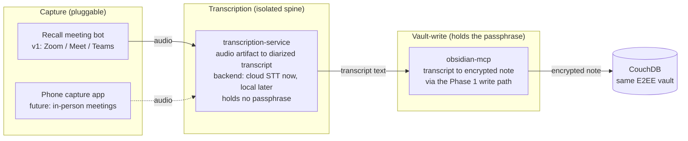
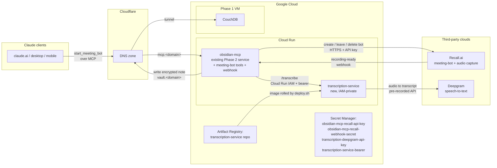
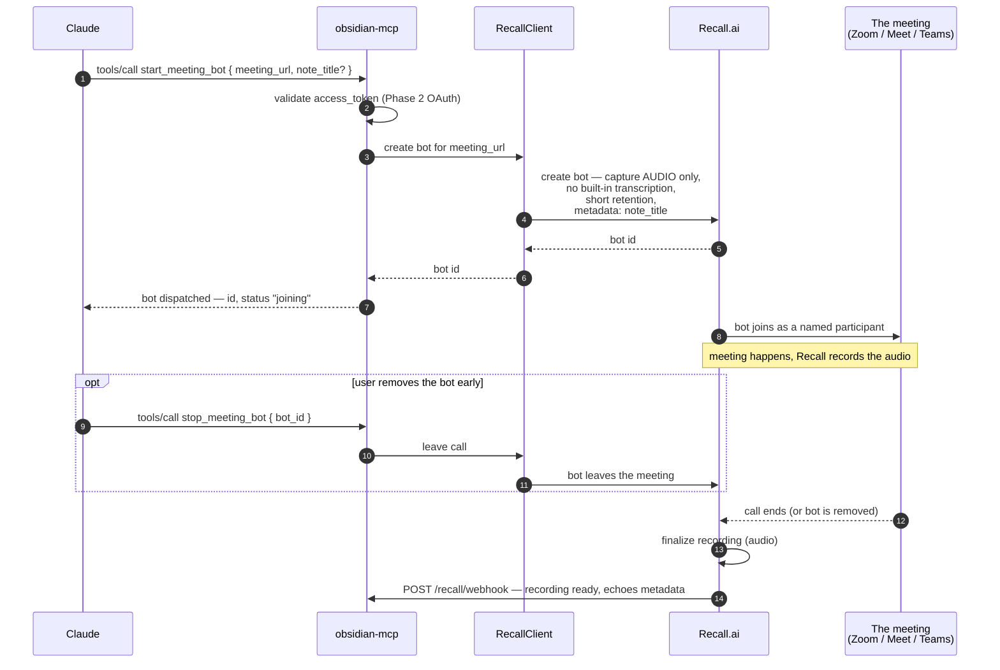
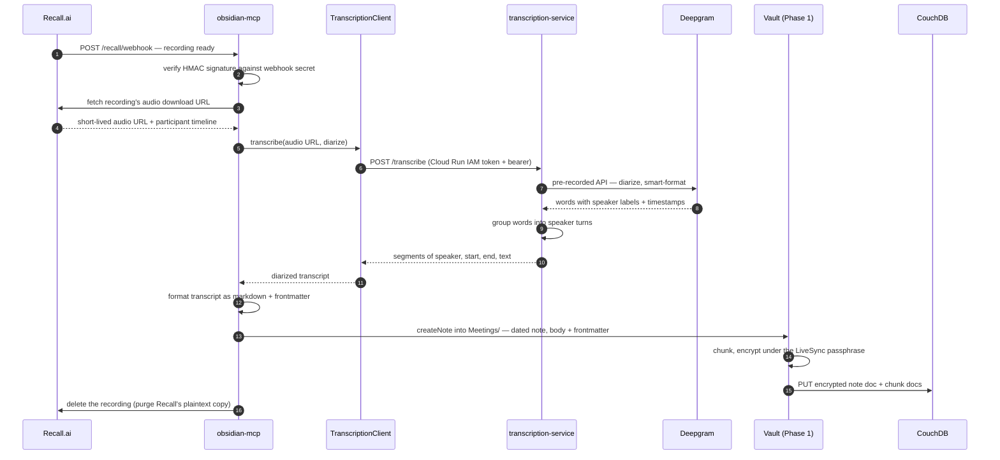
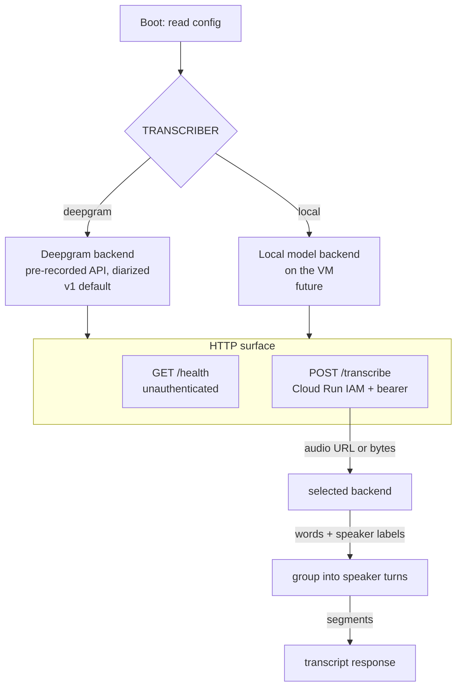
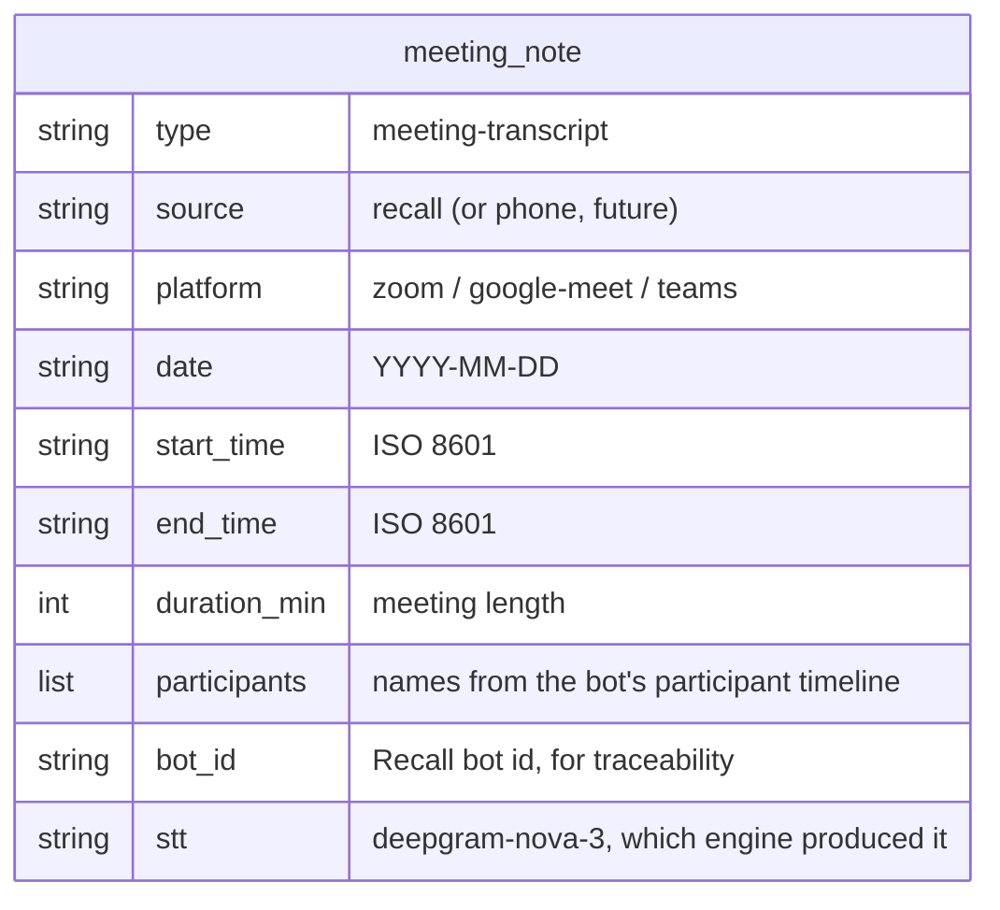
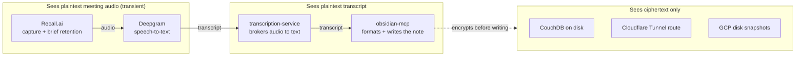
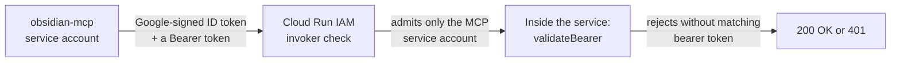

# Phase 4: Meeting transcription

The job of Phase 4 is to let a bot join a video meeting, transcribe it, and drop the transcript into the vault as an ordinary note. A user invites the bot from Claude — "record this meeting" with a link — and a few minutes after the call ends a speaker-labelled transcript appears in Obsidian on every device, already semantically searchable.

This phase introduces one new service and extends the MCP with three tools and one webhook route. It changes nothing about how Phase 1 stores notes or how Phase 3 indexes them — in fact Phase 3 indexes the transcripts for free, because a transcript is just a note. The only contract change is to Phase 2: `obsidian-mcp` gains the meeting-bot tools and an unauthenticated `mcp.<domain>/recall/webhook` route.

The design is built around one deliberate separation: **capture, transcription, and vault-write are three independent layers.** The meeting bot is only a capture source; the speech-to-text engine is its own isolated service; and writing the encrypted note stays where the passphrase already lives. That separation is what lets a future phone-based audio-capture app reuse the same transcription pipeline, and what lets the speech-to-text engine be swapped — from a cloud provider today to a local model later — without touching anything else.

There is one truth this phase cannot design around, stated plainly up front: a bot that hears a meeting is a participant in that meeting, so it receives the audio in plaintext. No arrangement of bot, transcriber, or storage makes live meeting capture end-to-end encrypted the way the vault is. Phase 4 confines that exposure to a single transient hop and writes only the finished transcript back through the vault's encryption. The [trust model](#trust-model) section is explicit about exactly who sees what.

## What this phase delivers

- A meeting bot, dispatched from Claude via MCP, that joins a Zoom, Google Meet, or Microsoft Teams call by URL, records the audio, and is torn down when the call ends or on request.
- A new `transcription-service` — a small, isolated Cloud Run service that turns an audio artifact into a diarized transcript, with a pluggable speech-to-text backend selected at boot (a cloud provider now, a local model later).
- Three new MCP tools — `start_meeting_bot`, `stop_meeting_bot`, `get_meeting_bot` — and one webhook route on the MCP that receives the bot's recording when the call is over.
- Transcripts written through the existing Phase 1 encryption path, so they replicate to every Obsidian device and are picked up by the Phase 3 indexer with no extra work — every past meeting becomes part of hybrid search.
- A capture-source interface that a future phone audio-capture app can plug into without touching the transcription or vault-write layers.

## The shape of the design: capture, transcription, vault-write

The whole phase is three layers with narrow contracts between them. Audio is captured by *some* source, handed to *one* transcription spine, and the resulting text is written by the *one* component that already holds the encryption passphrase.

Three properties fall out of this shape:

- **The transcription spine is the reusable part.** Both a cloud meeting bot and a phone recorder ultimately produce the same thing — an audio artifact — so the transcription-service takes audio and returns text, and nothing about it knows or cares where the audio came from. The phone app is a second capture source, not a second pipeline.
- **Speech-to-text is swappable in one place.** The transcription-service chooses its backend at boot from an environment variable. Today that is a cloud provider; later it can be a local model on the VM. Nothing upstream (the bot, the MCP tools) or downstream (the encrypted note) changes when it does.
- **The passphrase never leaves the component that already has it.** The transcription-service holds only its speech-to-text credential. It cannot read or write the vault. Writing the encrypted note stays inside `obsidian-mcp`, which already holds the LiveSync passphrase for every other tool. The set of things that can see plaintext notes does not grow.

## Components

The new and changed pieces are:

- **The `transcription-service` container.** A single TypeScript Node bundle on Cloud Run, scaled to zero. It exposes `POST /transcribe` (audio in, diarized transcript out) and `/health`. Its only secret is the speech-to-text API key. It is the isolated spine — reachable only by `obsidian-mcp`, never publicly, and never holding the vault passphrase. Built on the same `services/shared` library as the other services for its logger and tagged errors.
- **A new Artifact Registry repo** (`transcription-service`) for its images, separate from the MCP and indexer repos so tags don't collide.
- **Four new Secret Manager secrets:**
  - `obsidian-mcp-recall-api-key` — the Recall.ai API key the MCP uses to create, leave, and delete bots. Read by the MCP service account.
  - `obsidian-mcp-recall-webhook-secret` — the signing secret the MCP uses to verify that an incoming `/recall/webhook` request genuinely came from Recall.
  - `transcription-deepgram-api-key` — the speech-to-text credential. Read only by the transcription-service account. This is the single key whose holder sees plaintext meeting audio downstream of the bot.
  - `transcription-service-bearer` — a random shared token the MCP presents to the transcription-service, as a second gate behind Cloud Run IAM.
- **`obsidian-mcp`, extended.** Three new tools (`start_meeting_bot`, `stop_meeting_bot`, `get_meeting_bot`), a new unauthenticated `POST /recall/webhook` route, a Recall API client, and a transcription-service client. Its OAuth flow, its existing tools, and its trust model for Claude are all unchanged.
- **A Recall.ai account.** Provides the bot infrastructure that joins meetings and captures audio. Configured to capture audio only — its own transcription is not used — with the shortest practical retention.
- **A Deepgram account.** Provides the speech-to-text. Chosen as the v1 backend behind the transcription-service's pluggable interface.

## Why the transcription-service is its own service

It would be less code to fold speech-to-text directly into `obsidian-mcp`, or to use the meeting-bot vendor's built-in transcription. The phase does neither, for three reasons that all point at the same separation.

- **A second capture source is coming.** A phone-based audio-capture app for in-person meetings is a planned next step. It will produce a recording and need exactly the same thing the bot needs: audio turned into a transcript and filed in the vault. If transcription is its own service with a clean audio-in/text-out contract, the phone app reuses it directly. If it were buried in the meeting-bot path, the phone app would have to reimplement it.
- **Speech-to-text should be swappable without disturbing anything else.** Using the bot vendor's built-in transcription would weld the two together — changing transcribers would mean changing capture. A standalone service selects its backend at boot, so moving from a cloud provider to a local model is a configuration change and a redeploy of one service, invisible to the bot and to the vault.
- **The speech-to-text engine must never hold the vault passphrase.** Keeping it as a separate service with only its own API key makes that structural rather than a matter of discipline. The transcription-service literally cannot read or write notes; it has no CouchDB credentials and no passphrase.

For now the service runs on Cloud Run, for the same reasons the MCP does: it is a small, mostly-idle, request-driven HTTPS service, and scaling to zero means it costs nothing between meetings. The work it does in v1 is brokering audio to a cloud speech-to-text API — almost pure I/O — so it has no need for a persistent disk or a long-lived process.

That calculus inverts the day the backend becomes a local model. A local transcriber needs CPU (and realistically more memory than the bot-less services use), and it keeps audio inside the user's own infrastructure — which is the whole point of going local. At that point the transcription-service moves to the VM, next to CouchDB and the indexer, exactly as Phase 3 reasoned about the indexer. The HTTP contract (`POST /transcribe`) does not change; only the deploy target and the selected backend do. This is the mirror image of [Phase 3's "why the indexer is on the VM"](03-phase3-vault-indexer.md) — the indexer was born on the VM because it runs a model locally; the transcription-service starts on Cloud Run because it does not, yet.

## Dispatching a bot and capturing a meeting

Things worth understanding:

- **The bot captures audio, not a transcript.** Recall is configured for audio capture with its built-in transcription turned off. Speech-to-text is the transcription-service's job, deliberately — see [the design shape](#the-shape-of-the-design-capture-transcription-vault-write).
- **The MCP stays stateless across the gap.** Between dispatching the bot and the call ending — which may be an hour — the MCP holds nothing. The note title and any other per-job data are attached to the bot as Recall metadata, and Recall echoes them back in the webhook. There is no job database.
- **Removal works two ways.** The user can call `stop_meeting_bot` through Claude, or simply remove the bot from the meeting's own participant UI. Either way the recording is finalized and the webhook fires.
- **The bot is a visible, named participant.** Its presence is obvious to everyone in the call. This is the consent posture for v1: nothing is recorded unless the user explicitly dispatches a bot, and when one is present it is not hidden.

## From audio to an encrypted note

This is the core path: the webhook arrives, the audio is transcribed by the isolated spine, and the finished transcript is written back through the vault's encryption.

Things worth understanding:

- **The audio is fetched, transcribed, then deleted — in that order.** The recording is deleted from Recall only after the transcript has been produced and the note written. Until then the audio must remain fetchable. This is why v1 uses short retention plus an explicit delete rather than a stream-only mode: a batch transcription needs the recorded file to exist for the few minutes it takes to transcribe it.
- **The transcription-service brokers audio; it does not store it.** It accepts either an audio URL (the bot path — the speech-to-text provider fetches it) or raw audio bytes (the future phone-app path — the app uploads them). Either way the service keeps nothing.
- **The note is written by the one component that can.** `createNote` is the same Phase 2 write path every other tool uses: it formats the frontmatter and body, chunks them, encrypts each chunk and the path under the LiveSync passphrase, and writes the result to CouchDB. The transcript is ciphertext at rest exactly like every hand-written note.
- **Phase 3 picks it up automatically.** The new note lands in CouchDB, the `_changes` feed notifies the indexer, and the transcript is chunked and embedded like any other note. Meetings become part of hybrid search with no Phase-4 code.
- **The webhook is signature-verified and unauthenticated.** It sits outside the OAuth-gated `/mcp` surface — Recall is not a Claude client and holds no access token — so it is gated instead by an HMAC signature over the request body, checked against the webhook secret. An unsigned or wrongly-signed request is rejected.

## The transcription service

The service is small and has one shape: choose a backend at boot, expose one transcription endpoint, hold no vault access.

The backend is chosen exactly the way the Phase 3 indexer chooses its embedder: a single environment variable picks one implementation behind a shared interface, and every implementation returns the same shape — segments of `{ speaker, start, end, text }`. The `deepgram` backend calls Deepgram's pre-recorded API with diarization and smart formatting; a future `local` backend would run a model on the VM and return the same segments. Callers cannot tell which backend produced a transcript.

What the service deliberately is not: it holds no CouchDB credentials and no LiveSync passphrase, it keeps no state between requests, and it has no knowledge of meetings, calendars, or users. It is an audio-to-text function with an HTTP boundary.

## Where transcripts land

A transcript is filed as a dated note under `Meetings/`, with frontmatter that makes it findable and traceable and a body of speaker-labelled turns.

The body is the transcript grouped into speaker turns, each prefixed with a speaker label and a timestamp. In v1 the speaker labels are the diarization labels the speech-to-text engine assigns — "Speaker 0", "Speaker 1" — and the real attendee names are recorded in the `participants` frontmatter from the bot's participant timeline. Mapping diarization labels to real names is a later refinement: it needs separate per-participant audio tracks from the bot, which are heavier to capture, so v1 keeps the mixed-audio path and labels by diarized speaker.

Because the note is filed through the normal write path, it carries a real frontmatter/body shape, replicates to every device, and is indexed by Phase 3 — so "what did we decide about X in that meeting?" is answerable by the same `search_notes` tool that answers everything else.

## Trust model

Phase 4 is the one place in the stack where the end-to-end-encryption property cannot hold for the live data, and the model is about confining that, not pretending otherwise.

The honest accounting:

- **A meeting bot is a participant, so the bot vendor receives plaintext audio.** There is no E2EE mode for a bot's capture, and the meeting platforms themselves (Zoom, Meet, Teams) are not end-to-end encrypted by default — the platform already sees the call. The bot adds one more party to content that was never sealed the way the vault is. This is inherent to recording a meeting, not a flaw in this design.
- **The exposure is confined to a transient hop and one downstream vendor.** Recall is configured for the shortest practical retention and the recording is deleted as soon as the transcript exists, so the audio lives on Recall's servers for minutes, not indefinitely. Speech-to-text uses a single provider (Deepgram), so exactly two third parties touch plaintext audio, briefly, for meetings the user explicitly chose to record.
- **The stored transcript is end-to-end encrypted like every other note.** Once written, the transcript is chunked and encrypted under the LiveSync passphrase. CouchDB, the disk, Cloudflare, and GCP snapshots see only ciphertext, identical to a hand-typed note. The set of components that can read plaintext *notes* does not grow — the transcription-service is not one of them.
- **The transcription-service holds no vault access.** Its only credential is the speech-to-text key. It cannot read or write notes. Keeping it separate is what makes that structural.

Access from the MCP to the transcription-service is gated in two layers, in the spirit of the indexer's three:

1. **Cloud Run IAM** makes the transcription-service non-public. Only the `obsidian-mcp` service account holds the invoker role, and the MCP attaches a Google-signed identity token (fetched from the instance metadata server) on every call. A request without it never reaches the container.
2. **The service's own bearer check** verifies a shared random token against the one the MCP holds in `transcription-service-bearer`. A request that somehow reached the container without the bearer is still rejected.

There is no public hostname for the transcription-service at all — unlike the indexer, it is not exposed through Cloudflare, only reachable on its internal Cloud Run URL by the one service account allowed to invoke it.

## Cost

Phase 4 cost is purely usage-based and zero when no meeting is being recorded.

| Item | Service | Approx cost |
|---|---|---|
| Meeting bot + audio capture | Recall.ai | $0.50 per recording hour |
| Speech-to-text | Deepgram nova-3, pre-recorded | ~$0.26 per hour |
| Speaker diarization | Deepgram add-on | ~$0.12 per hour |
| **Per meeting-hour, all in** | | **~$0.88** |
| transcription-service | Cloud Run; scales to zero | ~$0.00 |
| Artifact Registry, secrets | small image, four secrets | < $0.10 / month |

The recurring footprint on top of the stack's ~$11–14/month base is negligible — a few cents of Cloud Run and storage. The meeting cost is per recorded hour and only incurred when a bot actually runs, so a handful of meetings a month is a dollar or two. The premium over using the bot vendor's own built-in transcription is deliberate: it buys the isolated, swappable speech-to-text layer that the phone-capture app will reuse and that can later move to a local model.

## Operational notes

- **Retention is short and deletion is explicit.** The bot is dispatched with the shortest practical retention, and the recording is deleted via the API immediately after the transcript is written. The audio is meant to live on the vendor's servers only for the minutes it takes to transcribe.
- **The webhook must be reachable and verified.** Recall posts to `mcp.<domain>/recall/webhook`. The route is public by necessity but every request is HMAC-verified against the webhook secret before anything happens.
- **The bot's name is set deliberately.** It joins as a clearly-named participant so its presence is obvious — the consent posture for v1, reinforced by the fact that recording only happens on explicit dispatch.
- **Swapping the speech-to-text backend is a config change.** The `TRANSCRIBER` environment variable selects the backend; moving from the cloud provider to a future local model is a redeploy of one service, with the same `POST /transcribe` contract.
- **Secrets rotate independently.** The Recall key, the webhook secret, the Deepgram key, and the MCP-to-service bearer are four separate secrets read by the two service accounts that need them; any can be rotated and the owning service redeployed without touching the others.
- **The deploy script owns its configuration.** As with the other services, `transcription-service`'s `deploy.sh` writes everything the running revision needs, so a redeploy works regardless of prior state.

## How Phase 4 composes with the rest of the system

Phase 4 is additive, like Phase 3:

- **Phase 1** is untouched. The VM, CouchDB, and the tunnel are reused only as the destination for the encrypted transcript note.
- **Phase 2** gains three tools, one webhook route, and two outbound clients (to Recall and to the transcription-service). Its OAuth flow, its existing tools, and its trust model for Claude clients are unchanged.
- **Phase 3** gains nothing it has to know about, and indexes every transcript automatically. Recorded meetings become first-class citizens of hybrid search.

Future capabilities that compose naturally on top of Phase 4:

- **Calendar auto-join (a "Phase 4.5").** Rather than dispatching each bot by hand, a watcher reads the user's Google Calendar and dispatches a bot for upcoming meetings that have a link, with per-meeting opt-out. The value-aligned form of this is a small watcher on the VM that polls the calendar and sends only the chosen meeting URLs to the bot — keeping the calendar itself inside the user's infrastructure rather than handing a calendar token to the bot vendor. It reuses the existing Google OAuth client with a read-only calendar scope, and requires publishing/verifying that OAuth app so its refresh token does not expire. v1 deliberately ships the manual MCP dispatch first; auto-join is a later layer on top of the same tools.
- **The phone audio-capture app.** A phone-based recorder for in-person meetings uploads its audio to the same `POST /transcribe` endpoint and the transcript is filed the same way. This is the capture source the isolated transcription spine was designed for.
- **A local speech-to-text backend.** Selecting a local model moves the transcription-service to the VM and keeps audio inside the user's infrastructure — a privacy upgrade for the phone-capture path in particular, where there is no bot vendor in the way to begin with.
- **Per-speaker name mapping.** Capturing separate per-participant audio tracks from the bot lets diarized speakers be resolved to real attendee names, replacing the "Speaker 0 / Speaker 1" labels of v1.
- **Downstream tools over transcripts.** Summaries, action items, and follow-ups are tools that read an existing transcript note — they build on Phase 4 rather than being part of it.

What Phase 4 deliberately does **not** do:

- It does not make meeting capture end-to-end encrypted. That is impossible for a bot that has to hear the meeting; the phase confines the exposure instead of claiming to remove it.
- It does not keep audio. The recording is transcribed and deleted; only the encrypted transcript persists.
- It does not give the speech-to-text engine any access to the vault. The transcription-service holds one credential — its speech-to-text key — and nothing else.
- It does not watch a calendar or record anything automatically. In v1 a bot exists only because the user dispatched one.
