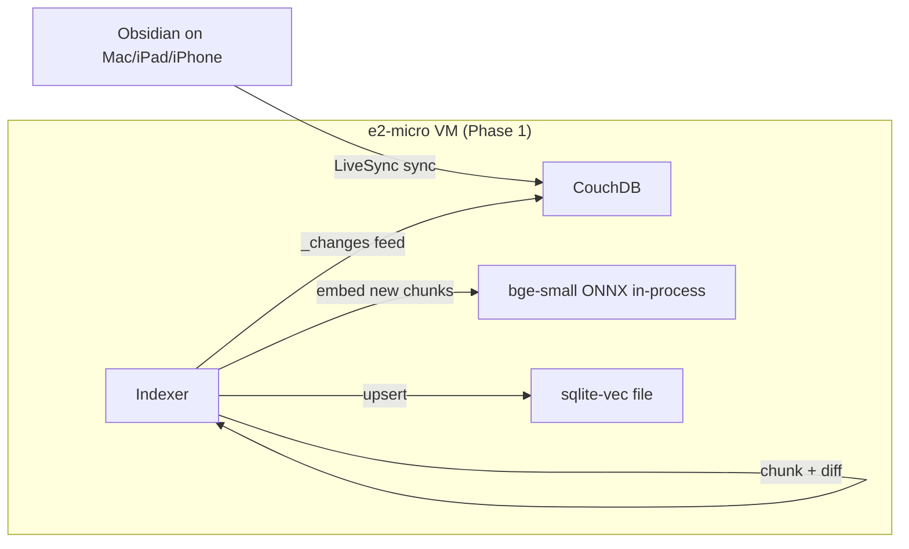
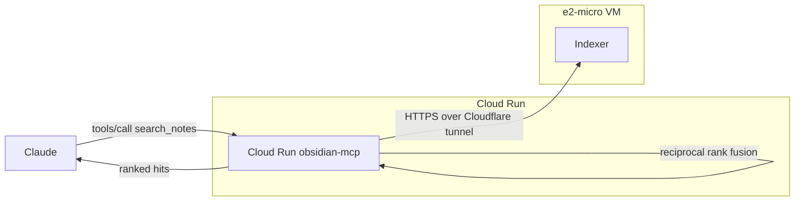

# Vault-indexer architecture

This document explains how Phase 3 fits with Phases 1 and 2: where the new process runs, what it owns, how data flows through it on indexing and on query, and what the trust model is around the new `/search` endpoint.

## Data flow

### Indexing path

A note edit propagates: Obsidian client → LiveSync → CouchDB → `_changes` event → indexer's per-doc-id debounce queue (collapses bursts) → `reindexNoteById` → decrypt → markdown chunker → content-addressed diff → embed only the new chunks → insert-before-delete upsert into `vault_chunks`.

### Query path

A `search_notes` call: Claude → MCP → both arms in parallel — BM25 against the in-process `SearchIndex`, and `POST /search` against `https://indexer.<domain>` — then RRF fuses the two ranked lists. If the indexer arm fails (timeout, 5xx, network, bad body), the failure is caught and the fusion runs against an empty semantic list, logging a `WARN` — the tool degrades to lexical-only rather than failing.

## Why the indexer is its own always-on process

`sqlite-vec` is a SQLite extension. SQLite is a file-based database. Whatever holds the file handle has to be a process on the same host as the file, and a Cloud Run service that scales to zero cannot.

Concretely:

- **Cloud Run scales to zero.** When no request is in flight the container is destroyed. A `vectors.db` mounted into it would only be alive for a few hundred ms at a time, defeating the purpose of an incremental index.
- **`sqlite-vec` is not a server.** It's loaded as a shared library inside a host process. There is no network protocol to drive it remotely.
- **The `_changes` subscriber must be persistent.** A scale-to-zero service cannot hold a long-poll connection to CouchDB.

So the indexer is **always-on** and lives **on the VM**. The MCP server stays where it is — stateless, scale-to-zero — and calls the indexer over HTTP.

This split has knock-on benefits: the indexer is the only writer to the SQLite file (no multi-process locking), the MCP service stays cheap (no new always-on cost), and you can scale them independently. The cost is one new container on the VM and one new HTTP hop on the query path (sub-50 ms intra-Cloudflare-tunnel, dwarfed by embedding inference time).

## Trust model for `/search`

The MCP server reaches the indexer at `https://indexer.<domain>`. That hostname is **not** a public API — it's protected by **two** independent layers:

1. **Cloudflare Access**, on the edge. The `cloudflare_access_application` for `indexer.<domain>` carries a `non_identity` policy that only admits requests presenting the `obsidian-mcp-to-vault-indexer` service token. Anyone else (a human in a browser, a different service token, no token) gets a 403 from Cloudflare before the request ever reaches cloudflared on the VM.
2. **Bearer token**, inside the indexer. The indexer's `/search` handler does a constant-time comparison against `SEARCH_BEARER_TOKEN` (sourced from Secret Manager via `/opt/vault-indexer/.env`). The MCP server reads the same value as `INDEXER_BEARER_TOKEN`. A request that makes it through Access but lacks (or has the wrong) bearer gets a 401 from the indexer itself.

Both checks must succeed. The token rotation story is straightforward: re-run `terraform apply` to regenerate `random_password.vault_indexer_search_token`, then `scripts/vault-indexer/deploy.sh` to push the new value into the VM's `/opt/vault-indexer/.env`, then the MCP server picks it up at the next cold start because Cloud Run reads the secret at request time. CF Access service-token rotation similarly: `terraform taint cloudflare_access_service_token.mcp_to_indexer && terraform apply`.

`/health` is intentionally **unauthenticated** at the indexer layer, but it sits behind the Access gate too — so a 200 means "Access let you in AND the indexer is up." That's exactly what `deploy.sh`'s health check wants to know.

## Composing with future features

The indexer's `/search` endpoint is the natural place to add more retrieval capabilities later:
- **Transcription search**: index audio-file transcripts the same way (chunks, embeddings, hybrid).
- **Reminders / calendar items**: surface notes scheduled for a particular date through a `/search?filter=date` query.
- **Cross-modal**: image-derived embeddings (CLIP-style) alongside text embeddings, with the same hybrid pipeline.

The `Embedder` interface and the tagged `embedding_model` columns mean adding new models is a clean re-embed under a new schema, not a hack.

## What's NOT in the indexer

- **No write path.** The indexer is read-only against CouchDB. Notes are written through the MCP server's tools (which already exist).
- **No auth-server logic.** OAuth, IdP, JWT — all in the MCP server. The indexer just trusts the bearer token.
- **No multi-tenant logic.** One vault, one passphrase, one model. A productised version handling other people's data is documented in [embedding-model.md](embedding-model.md) and is a different code path.
